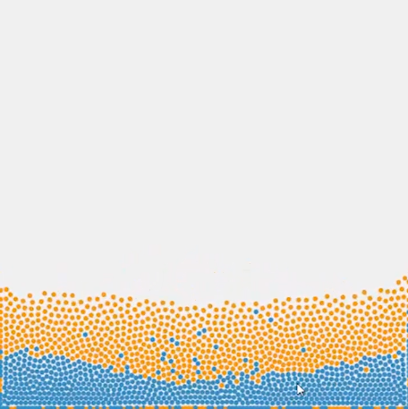
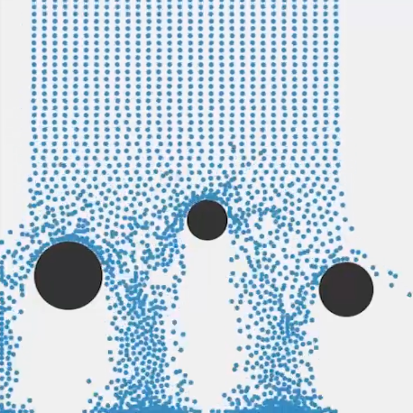

# Position Based Fluids (2D)

This project implements a interactive 2D fluid simulator using the algorithm proposed in this article,

> M. Macklin and M. Müller, “Position based fluids,” ACM Transactions on Graphics, vol. 32, no. 4, pp. 1–12, 2013.

## Run

Our project uses Python and Taichi, to run our project, first install Taichi by,

    python3 -m pip install taichi

Then, you can simply

    python3 simulation1.py          # also the other two simulations

## Interactive UI:

-   Left mouse button: attractive force
-   Right mouse button: repulsive force

## Screenshots

## GPU

You can use GPU by change the line

    ti.init(arch=ti.cpu)

to

    ti.init(arch=ti.gpu)

This line is located on the top of each python file. It also runs smoothly on CPU.

Video Link: https://youtu.be/jObUPvEFTRk
